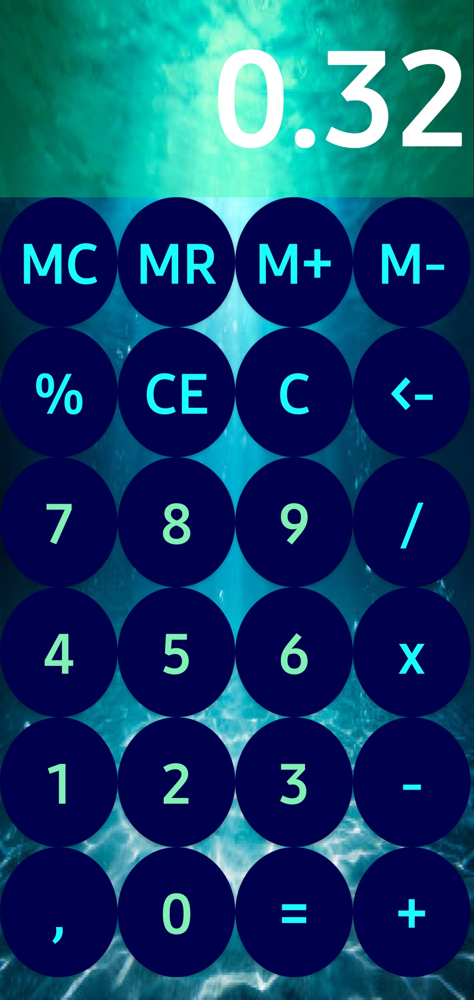
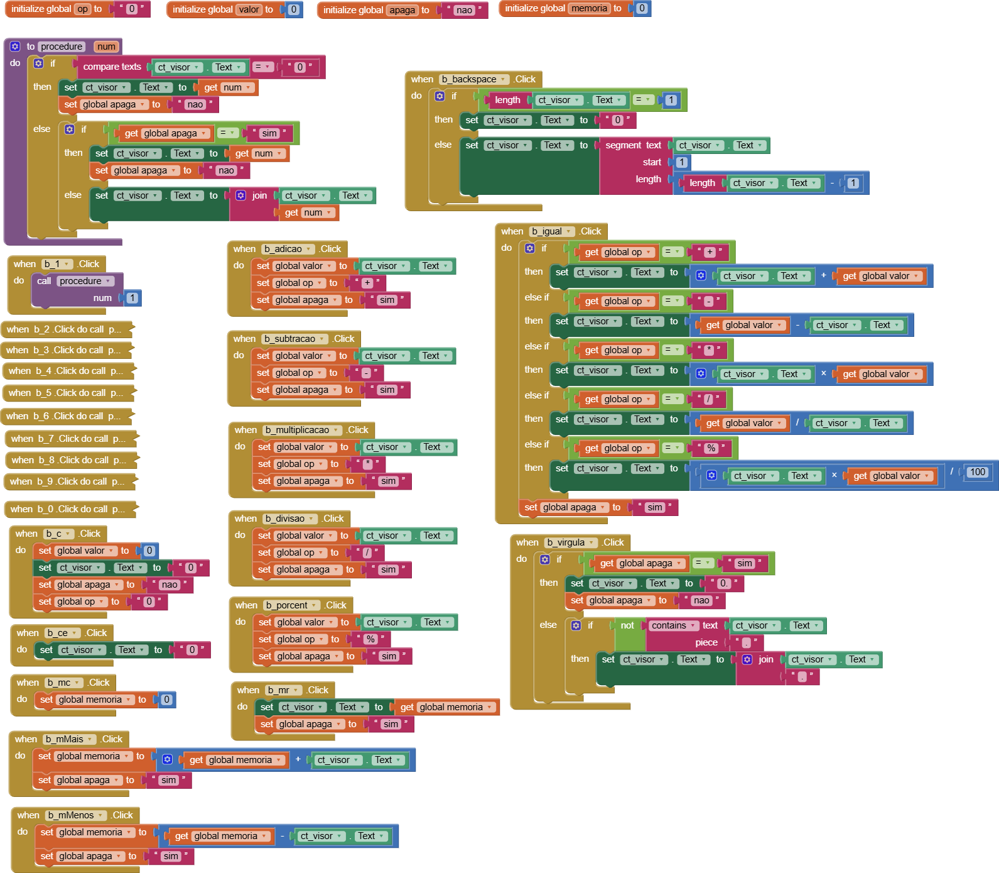

# 📱 Calculadora Neto

  

  <em>Aplicativo móvel desenvolvido no MIT App Inventor para a disciplina de Programação de Aplicativos Mobile 2 (PAM2).</em>

---

## 📖 Sobre o Projeto

O **Calculadora Neto** é um aplicativo mobile desenvolvido com o objetivo de oferecer uma ferramenta prática, acessível e intuitiva para a realização de cálculos matemáticos fundamentais no dia a dia. 

Este projeto foi elaborado no contexto acadêmico para a disciplina de **Programação de Aplicativos Mobile 2 (PAM2)**, sob a orientação do **Professor Flávio**, na **Etec**. A proposta visa consolidar conceitos fundamentais de desenvolvimento mobile, design de interface e lógica de programação orientada a eventos.

### ✨ Funcionalidades Principais

- ➕ **Operações Aritméticas Básicas:** Realização rápida e precisa de soma, subtração, multiplicação e divisão.
- 🧹 **Limpeza de Dados (Clear):** Botão para resetar os valores inseridos e reiniciar o fluxo de cálculos com um toque.
- 🎯 **Tratamento de Entradas:** Validação de dados para evitar erros comuns de cálculo e campos em branco.
- 📱 **Interface Intuitiva:** Layout organizado com botões de fácil visualização e toque, garantindo excelente usabilidade no Android.

---

## 🖥️ Interface e Identidade Visual

A interface foi projetada para ser limpa e direta ao ponto, proporcionando uma experiência de uso fluida e agradável.

| Ícone do Aplicativo | Tela da Calculadora em Execução |
| :---: | :---: |
|  |  |
| **`iconCal.png`** | **`calculadora.jpg`** |

---

## 🧩 Lógica de Programação (Blocos)

A lógica operacional do aplicativo foi inteiramente construída por meio do paradigma de programação em blocos do **MIT App Inventor**. 

A estrutura abrange a captura dos dados fornecidos pelo usuário nos campos de entrada, a chamada dos operadores aritméticos conforme o botão acionado e a renderização dinâmica do resultado final na tela.

  
   
  <em>Figura: Lógica de eventos e operações matemáticas estruturada no MIT App Inventor (<code>blocks.png</code>).</em>

---

## 🛠️ Tecnologias e Ferramentas

- **[MIT App Inventor](https://appinventor.mit.edu/):** Ambiente de desenvolvimento visual por blocos utilizado para desenhar a interface e implementar os algoritmos.
- **Android OS:** Plataforma móvel de destino para compilação e teste do pacote `.apk`.
- **Git & GitHub:** Controle de versão e documentação pública do projeto acadêmico.

---

## 🚀 Como Utilizar e Testar

Você pode experimentar ou modificar o aplicativo através das seguintes opções:

### 1. Instalar diretamente no Android (`.apk`)
1. Baixe o arquivo `.apk` disponibilizado na raiz deste repositório ou na aba de *Releases*.
2. Transfira para o seu smartphone Android e autorize a instalação de fontes desconhecidas caso solicitado.
3. Abra o aplicativo e realize suas operações matemáticas.

### 2. Abrir e editar o projeto no MIT App Inventor (`.aia`)
1. Faça o download do arquivo com extensão `.aia` presente neste repositório.
2. Acesse a plataforma [MIT App Inventor](https://appinventor.mit.edu/) com sua conta Google.
3. No menu superior, vá em **Projects** > **Import project (.aia) from my computer**.
4. Selecione o arquivo baixado para explorar a interface (Designer) e o código (Blocks).

---

## 👨‍🏫 Informações Acadêmicas

- **Instituição:** Etec
- **Disciplina:** Programação de Aplicativos Mobile 2 (PAM2)
- **Orientação:** Prof. Flávio
- **Projeto:** Calculadora Neto (`calculadoraNeto-pam`)
